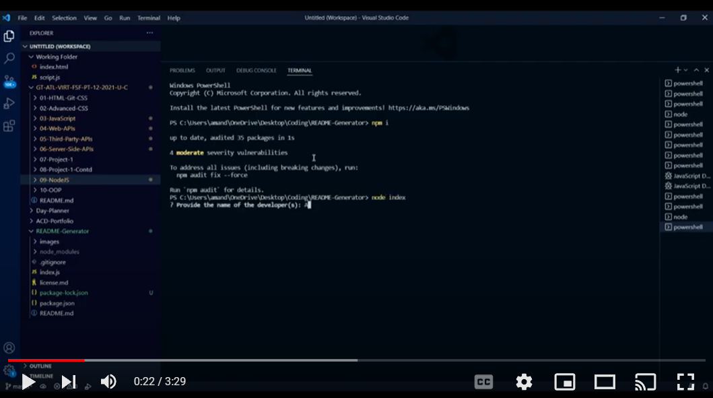

# Social Network API
## Description
For this project, I created an API for a social network web application where users can share their thoughts, react to friends’ thoughts, and create a friend list. I utilized Express.js for routing, a MongoDB database, and the Mongoose ODM.

## Table of Contents
- [Usage](#usage)
- [User Story](#user-story)
- [Acceptance Criteria](#acceptance-criteria)
- [Credits](#credits)
- [License](#license)

## Usage
Visit my [repo here](https://github.com/Quadrilateral0/Social-Network-API) and see below for a video demo.

The application requires [Node.js](https://nodejs.dev/learn/introduction-to-nodejs). Install the necessary dependencies in your terminal using the following command:
```bash
npm i
```
seed the database with:
```bash
npm i
```
and invoke the program by using:

```bash
npm start
```

[](https://youtu.be/d3MFNtsxTxM)


## User Story

```md
AS A social media startup
I WANT an API for my social network that uses a NoSQL database
SO THAT my website can handle large amounts of unstructured data
```

## Acceptance Criteria

```md
GIVEN a social network API
WHEN I enter the command to invoke the application
THEN my server is started and the Mongoose models are synced to the MongoDB database
WHEN I open API GET routes in Insomnia for users and thoughts
THEN the data for each of these routes is displayed in a formatted JSON
WHEN I test API POST, PUT, and DELETE routes in Insomnia
THEN I am able to successfully create, update, and delete users and thoughts in my database
WHEN I test API POST and DELETE routes in Insomnia
THEN I am able to successfully create and delete reactions to thoughts and add and remove friends to a user’s friend list
```

## Credits
A thanks to my tools and resources:
- [Mongoose](https://www.npmjs.com/package/mongoose)
- [Express.js](https://www.npmjs.com/package/express)
- [Node.js](https://nodejs.dev/learn/introduction-to-nodejs) 
- [Insomnia](https://insomnia.rest/)
- [Screencastify](https://chrome.google.com/webstore/detail/screencastify-screen-vide/mmeijimgabbpbgpdklnllpncmdofkcpn?hl=en)
- [Visual Studio Code](https://code.visualstudio.com/download)

And thanks to these tutorials:
- [MDN Web Docs](https://developer.mozilla.org/)
- [W3 Schools](https://www.w3schools.com/)

## License
